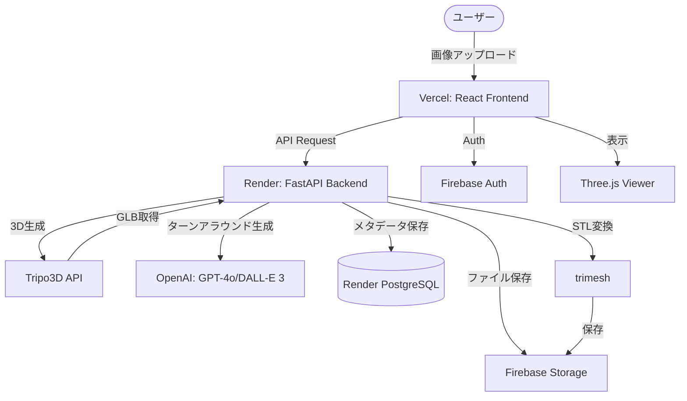

# うちの子製作所 (Uchi-no-ko Factory)

> **好きなものを、手のひらに。**


1枚の写真やイラストからAIで高品質な3Dモデルを生成し、3Dプリンターで印刷可能なデータとして即座に書き出す「最短のクリエイティブ・パイプライン」です。

---

## 🌟 プロジェクトの概要

「うちの子製作所」は、**3Dモデリングの知識がなくても、画像1枚から物理的なモノを作れる**体験を提供します。

既存の3D生成AIをコアエンジンに採用し、3Dプリントに必要な「厚み付け」「メッシュ補完」「ファイル変換」を自動化することで、誰でも簡単に「思い出の具現化」ができるプラットフォームを目指しています。

### 🚀 解決する課題：流通の壁をゼロに
- **物流コストの解消**: データを送るだけなので送料・納期がゼロ。
- **ニッチ需要への対応**: 公式グッズがないマイナーキャラや個人の創作物も立体化可能。
- **クリエイター支援**: 公式や個人作家が3Dデータを直接ファンに販売できる新しい流通形態。

## ✨ 主な機能

- 📸 **AI 3D Generation**: Tripo3D API を活用し、画像から高品質な3Dモデルを生成。
- 🔄 **Turnaround Generation**: GPT-4o + DALL-E 3 を用い、1枚の画像から「見えない裏側」を含むターンアラウンド画像を生成し、より精度の高い3D化をサポート。
- 🎨 **3D Viewer**: Browser上で生成されたモデルを全方位から確認できる高精細ビューア。
- 🛠️ **Print-Ready Export**: 3Dプリンタでそのまま扱える `.stl` / `.obj` 形式への自動変換とメッシュ修復。
- 🛒 **Marketplace**: 生成した作品の公開・共有、および3Dデータの売買が可能なコミュニティ機能。

## 🛠️ 技術スタック

### Frontend
- **Framework**: React + Vite (**TypeScript**)
- **3D Rendering**: React Three Fiber / Three.js
- **Styling**: Tailwind CSS v4
- **State Management**: Zustand
- **Deployment**: **Vercel**

### Backend
- **Framework**: FastAPI (Python)
- **Database**: **PostgreSQL (Render)**
- **Storage**: Firebase Storage
- **Auth**: Firebase Authentication
- **AI Engines**: 
  - **Tripo3D API** (3D Model Generation)
  - **GPT-4o / DALL-E 3** (Turnaround Sheet Generation)
- **Mesh Processing**: trimesh (GLB to STL conversion)
- **Deployment**: **Render**

## 🏗️ システム構成図



## 📋 セットアップ

### Frontend
```bash
cd frontend
npm install
npm run dev
```

### Backend
```bash
cd backend
python -m venv venv
source venv/bin/activate  # Windows: .\venv\Scripts\activate
pip install -r requirements.txt
uvicorn main:app --reload
```

## 🗺️ ロードマップ
- [x] 1枚の画像からの3D生成
- [x] GPT-4oによるターンアラウンド生成とマルチビュー3D化
- [x] ブラウザ上での3Dプレビュー
- [x] STL形式への書き出し
- [ ] AIを用いた高品質化
- [ ] 検索・タグ付け機能
- [ ] 企業のグッズコンペする場の提案
- [ ] 公式ライセンス管理機能（DRM）
- [ ] クリエーターの実績を作れる場の提案

---

*うちの子製作所 — Hack-1グランプリ 2026出展作品*
