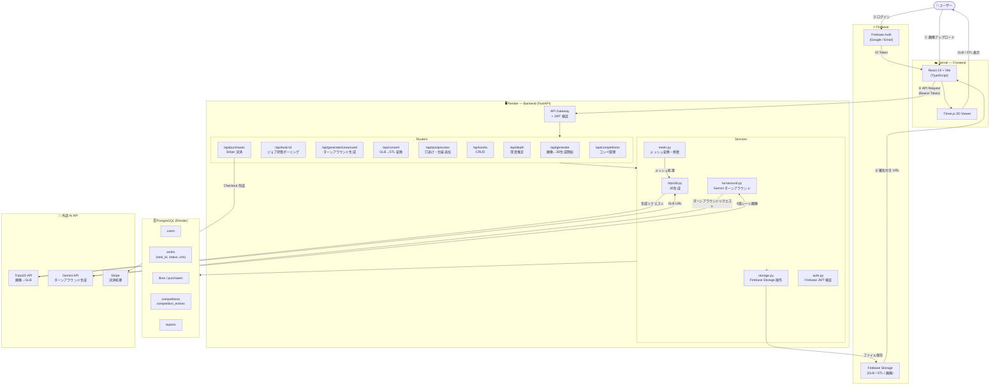

# うちの子製作所 (Uchi-no-ko Factory)

> **好きなものを、手のひらに。**

<p align="center">
  
</p>

<p align="center">
  <a href="https://utinoko.skphooh.com">🌐 Live Demo</a> ·
  <a href="#-セットアップ">🛠 Setup</a> ·
  <a href="#-システム構成">🏗 Architecture</a>
</p>

写真やイラスト **1枚** から AI が高品質な 3D モデルを生成し、3D プリンターで印刷可能な STL データを即座に出力する「最短のクリエイティブ・パイプライン」です。

---

## 🌟 プロジェクト概要

「うちの子製作所」は、**3D モデリングの知識ゼロでも、画像 1 枚から物理的なモノを作れる** 体験を提供します。

既存の 3D 生成 AI をコアエンジンに採用し、3D プリントに必要な「厚み付け」「メッシュ補完」「ファイル変換」を自動化することで、誰でも簡単に「思い出の具現化」ができるプラットフォームを目指しています。

### 解決する課題：流通の壁をゼロに

| 課題 | 解決 |
|------|------|
| マイナーキャラのグッズが存在しない | 画像さえあれば誰でも立体化できる |
| 送料・納期・在庫コストの壁 | データ配信なので送料ゼロ・即時 |
| 公式グッズの転売・品切れ | 公式が 3D データを直接ファンへ販売できる |
| 同人・個人創作のグッズ化が困難 | 個人作家が自分のキャラを STL で販売できる |

---

## ✨ 主な機能

| 機能 | 説明 |
|------|------|
| 📸 **AI 3D Generation** | Tripo3D API で画像→GLB を非同期生成。`standard` / `high`（PBR テクスチャ）品質を選択可 |
| 🔄 **Turnaround Generation** | Gemini API で「見えない裏面」を補完した 4 面ターンアラウンドシートを生成し、マルチビュー 3D 化の精度を向上 |
| 🎨 **3D Viewer** | React Three Fiber / Three.js によるブラウザ内インタラクティブビューア |
| 🛠️ **Print-Ready Export** | trimesh + manifold3d で GLB → STL 自動変換・メッシュ修復・ストラップ穴・台座追加 |
| 🛒 **Marketplace** | 生成作品の公開・共有・売買ができるコミュニティ機能（いいね・カテゴリフィルタ・無限スクロール） |
| 💳 **Stripe 決済** | 有料データの Stripe Checkout による購入フロー・Webhook による購入確認 |
| 🏆 **コンペティション** | 企業スポンサードのデザインコンペ参加・エントリー管理 |
| 🛡️ **管理ダッシュボード** | 作品通報・コンペ管理・ユーザー管理のための管理者機能 |

---

## 🛠️ 技術スタック

### Frontend（Vercel）

| カテゴリ | 技術 |
|----------|------|
| Framework | React 19 + Vite 8 (TypeScript 6) |
| 3D Rendering | React Three Fiber / Three.js / @react-three/drei |
| Styling | Tailwind CSS v4 |
| State | Zustand |
| Auth | Firebase Authentication (クライアント SDK) |
| Routing | React Router v7 |

### Backend（Render）

| カテゴリ | 技術 |
|----------|------|
| Framework | FastAPI (Python 3.12+) |
| ORM | SQLAlchemy (async) + asyncpg |
| Database | PostgreSQL (Render managed) |
| Storage | Firebase Storage |
| Auth | Firebase Admin SDK (JWT 検証) |
| AI — 3D 生成 | Tripo3D API |
| AI — ターンアラウンド | Gemini API (gemini-3.1-flash-image-preview) |
| Mesh 処理 | trimesh + manifold3d |
| 決済 | Stripe (Checkout + Webhook) |

---

## 🏗️ システム構成



### データフロー詳細（3D 生成）

```
① 画像アップロード
   ブラウザ → POST /api/generate (multipart)
   
② ジョブ開始
   Backend → Tripo3D API (非同期タスク発行)
   PostgreSQL: work.status = "processing"

③ ポーリング
   Frontend → GET /api/task/{task_id} (3秒間隔)
   Backend → Tripo3D API でステータス確認

④ 完成時
   Backend: GLB を Firebase Storage に保存
   trimesh で STL に変換 → Firebase Storage に保存
   PostgreSQL: work.status = "completed", URLs を更新

⑤ 表示
   Frontend: 署名付き URL で Three.js Viewer に読み込み
   ダウンロードボタンで STL / GLB を取得
```

---

## 📋 セットアップ

### 前提条件

- Node.js 20+
- Python 3.12+
- Firebase プロジェクト（Auth + Storage 有効化）
- Tripo3D API キー
- Gemini API キー

### Frontend

```bash
cd frontend
cp ../.env.example .env      # VITE_ 変数を設定
npm install
npm run dev                  # http://localhost:5173
```

### Backend

```bash
cd backend
python -m venv venv
source venv/bin/activate     # Windows: .\venv\Scripts\activate
pip install -r requirements.txt
cp ../.env.example .env      # バックエンド変数を設定
uvicorn main:app --reload    # http://localhost:8000
```

---

## 🔐 環境変数

`.env.example` を各ディレクトリの `.env` にコピーして設定してください。

| 変数 | 対象 | 説明 |
|------|------|------|
| `VITE_FIREBASE_*` | Frontend | Firebase クライアント設定 |
| `VITE_API_BASE_URL` | Frontend | FastAPI サーバー URL |
| `DATABASE_URL` | Backend | PostgreSQL 接続文字列 (`postgresql+asyncpg://...`) |
| `TRIPO3D_API_KEY` | Backend | Tripo3D API キー |
| `GEMINI_API_KEY` | Backend | Gemini API キー（ターンアラウンド生成） |
| `FIREBASE_SERVICE_ACCOUNT` | Backend | Firebase Admin SDK 用 JSON (1行) |
| `STRIPE_SECRET_KEY` | Backend | Stripe シークレットキー |
| `STRIPE_WEBHOOK_SECRET` | Backend | Stripe Webhook 署名シークレット |
| `FRONTEND_URL` | Backend | Stripe リダイレクト先 URL |
| `ADMIN_PASSWORD` | Backend | 管理者 API 認証パスワード |

---

## 📡 主要 API エンドポイント

| Method | Path | 説明 |
|--------|------|------|
| `POST` | `/api/generate` | 画像→3D 生成ジョブ開始 |
| `GET` | `/api/task/{task_id}` | 生成ジョブ状態ポーリング |
| `POST` | `/api/generate/turnaround` | Gemini によるターンアラウンドシート生成 |
| `POST` | `/api/convert` | GLB → STL 変換 |
| `POST` | `/api/postprocess/strap-hole` | ストラップ穴追加 |
| `POST` | `/api/postprocess/base` | 台座追加 |
| `GET` | `/api/works` | 作品一覧取得（フィルタ・ページネーション） |
| `POST` | `/api/works/{id}/like` | いいね追加・解除 |
| `GET` | `/api/purchases/check/{work_id}` | 購入済み確認 |
| `POST` | `/api/purchases/checkout` | Stripe Checkout セッション作成 |
| `POST` | `/api/purchases/webhook` | Stripe Webhook 受信 |
| `GET` | `/api/competitions` | コンペ一覧取得 |
| `POST` | `/api/competitions/{id}/entry` | コンペへのエントリー |
| `GET` | `/health` | ヘルスチェック |

---

## 🗺️ ロードマップ

- [x] 1枚の画像からの 3D 生成（Tripo3D）
- [x] Gemini によるターンアラウンド生成とマルチビュー 3D 化
- [x] ブラウザ上での 3D プレビュー（GLB / STL 切り替え）
- [x] STL 形式への書き出し・ストラップ穴・台座追加
- [x] マーケットプレイス（カテゴリフィルタ・いいね・無限スクロール）
- [x] Stripe による有料データ購入フロー
- [x] 企業向けグッズコンペ機能
- [ ] Wonder3D / 高品質モデルへの切り替え（イラスト特化）
- [ ] 公式ライセンス管理（DRM）
- [ ] クリエイター実績・ポートフォリオ機能
- [ ] 近くの 3D プリンター保有者マッチング

---

*うちの子製作所 — Hack-1 グランプリ 2026 出展作品*
